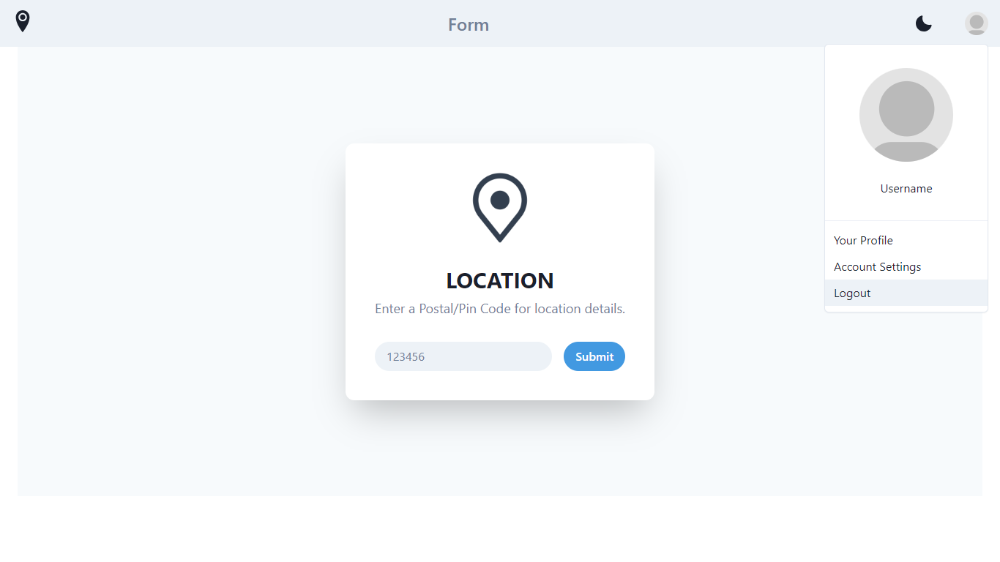
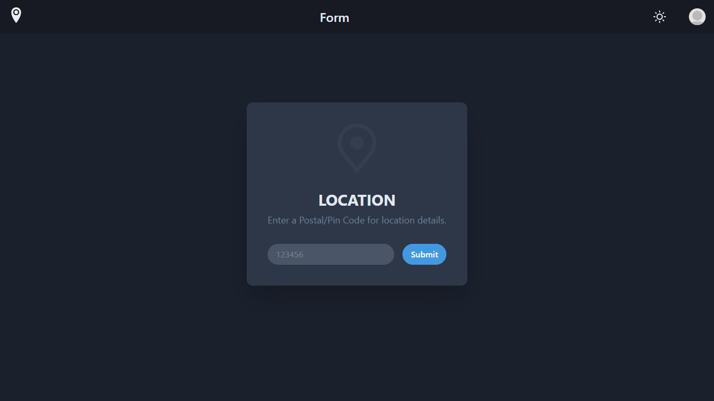
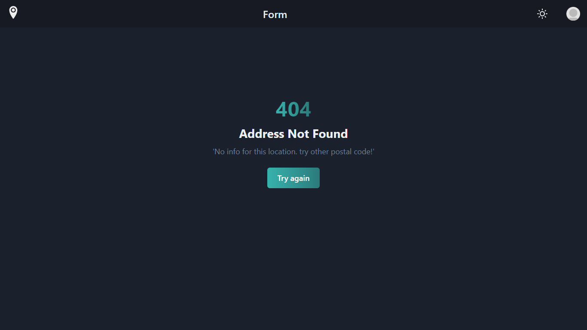
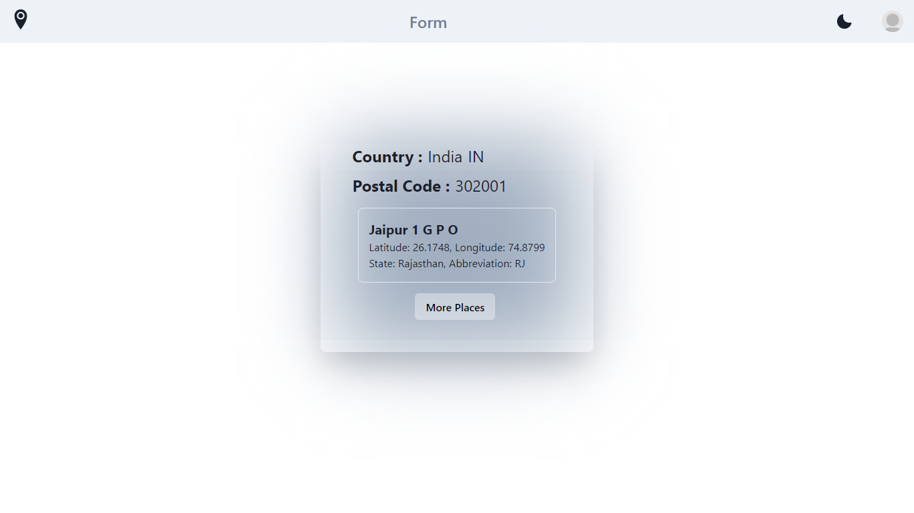
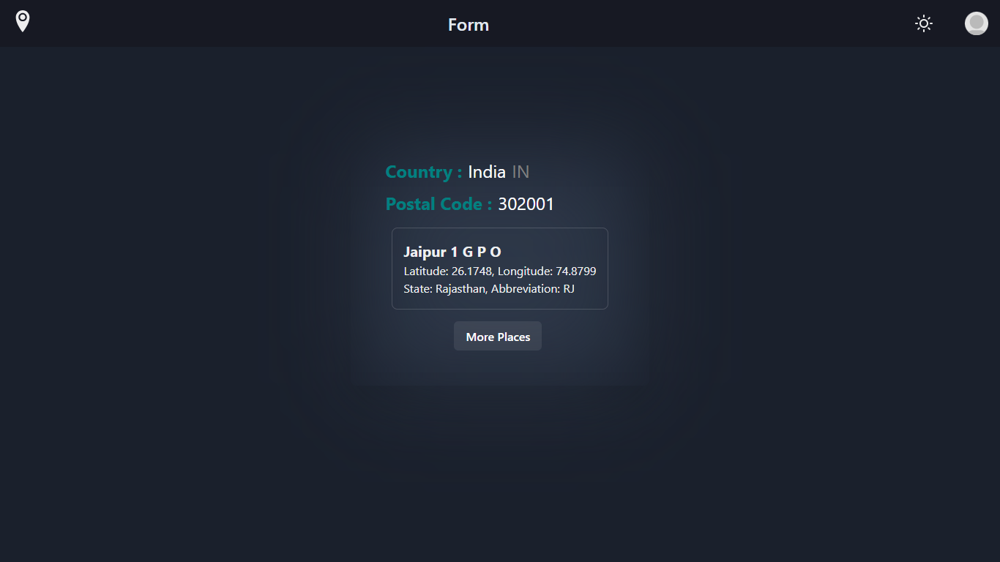
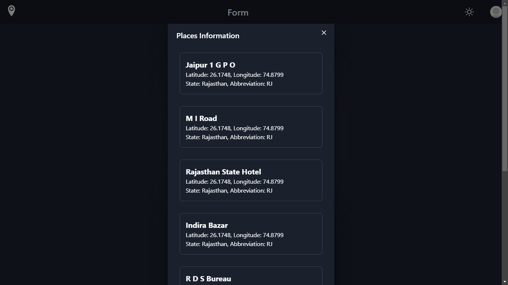

# Cuvette Project

This repository contains the source code for the Lead school Location project, an application that provides location information using postal code.

**Deployment Link:** [Lead school project Deployment](https://location-retrieval-lead-school.netlify.app/)

## Table of Contents

- [Prerequisites](#prerequisites)
- [Getting Started](#getting-started)
  - [Installing Dependencies](#installing-dependencies)
- [Usage](#usage)
  - [Running the Server](#running-the-server)
  - [Endpoints](#endpoints)
- [License](#license)

## Prerequisites

Before you begin, ensure you have met the following requirements:

- npm installed on your development machine.
- React setup.

## Getting Started

### Installing Dependencies

To install project dependencies, run the following command:

```bash
npm install
```




## Usage

### Running the Server

To start the server, run the following command:

```bash
npm run dev
```




### Endpoints

- `/location`: Provides location info and near places.

- `/`: A Form for providing postal code.

## Deployment

This project is deployed at the following URL: [Lead school project Deployment](https://location-retrieval-lead-school.netlify.app/)



## License

This project is open-source and free to use without any specific license restrictions. You are free to use, modify, and distribute this software as needed.

<div align="center">
  <b>Thanks for your Time....</b>
</div>
